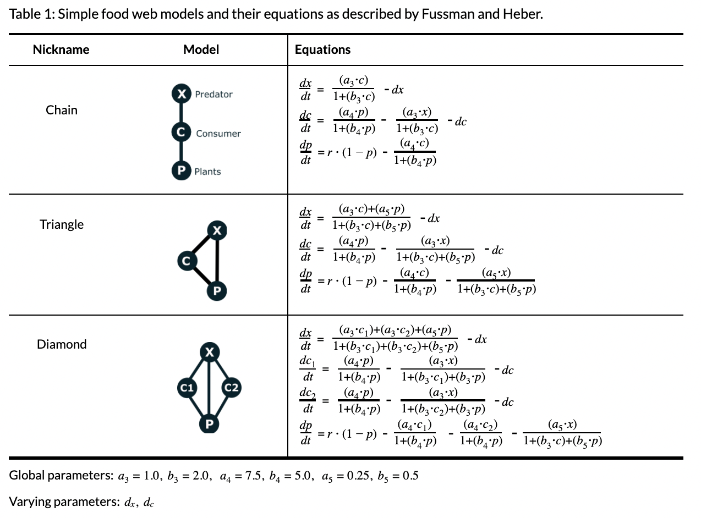
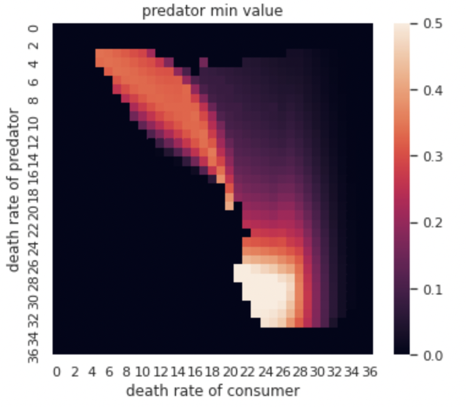
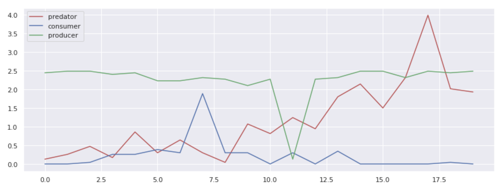
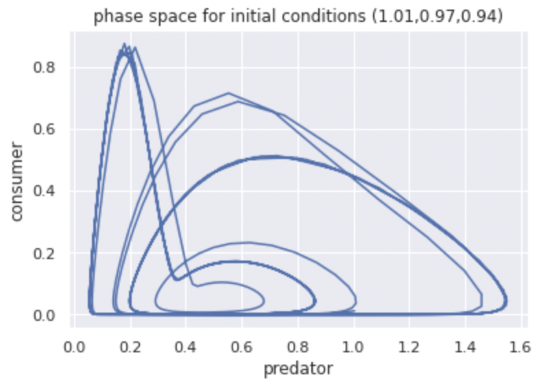

# Machine learning for chaotic time-series data generated from simple food webs

## Generating the data
[MakeData.ipynb](MakeData.ipynb)
* This is where all the data is produced for the machine learning experiment. The calculation was optimized using Python's built-in Runge-Kutta integration to ensure that the time step is always small enough.

## Visualizing the data
[coexistence.ipynb](coexistence.ipynb)
* Begining to analyze the results of the simulation, I attempt to visualize at which death rates species tend to survive or parish statistically based on the simulations.

## Analyzing the data
[foodweb_vs_random.ipynb](foodweb_vs_random.ipynb)

[foodweb_vs_random_v2.ipynb](foodweb_vs_random_v2.ipynb)
* By creating some random time series data that is similar to real data except completely random, we can do a quick comparison agaisnt the real data to find hidden motifs or shapes. All the data is input into a binary classifier, and then the filter is visualized for possible clues about the nature of the data.

## Machine learning
[single_species_classification.ipynb](single_species_classification.ipynb)
* By looking at time series data produced from 3 different food web structures, the AI learns to classify not only which food web the data comes from but also which individual species and level in the web it came from, even when the data is chaotic.

## Final Analysis

